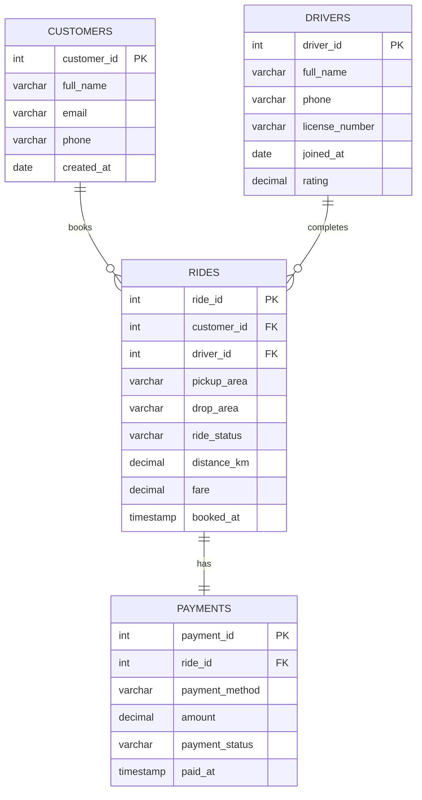

```mermaid
erDiagram
    CUSTOMERS ||--o{ RIDES : books
    DRIVERS ||--o{ RIDES : completes
    RIDES ||--|| PAYMENTS : has

    CUSTOMERS {
        int customer_id PK
        varchar full_name
        varchar email
        varchar phone
        date created_at
    }

    DRIVERS {
        int driver_id PK
        varchar full_name
        varchar phone
        varchar license_number
        date joined_at
        decimal rating
    }

    RIDES {
        int ride_id PK
        int customer_id FK
        int driver_id FK
        varchar pickup_area
        varchar drop_area
        varchar ride_status
        decimal distance_km
        decimal fare
        timestamp booked_at
    }

    PAYMENTS {
        int payment_id PK
        int ride_id FK
        varchar payment_method
        decimal amount
        varchar payment_status
        timestamp paid_at
    }
```
